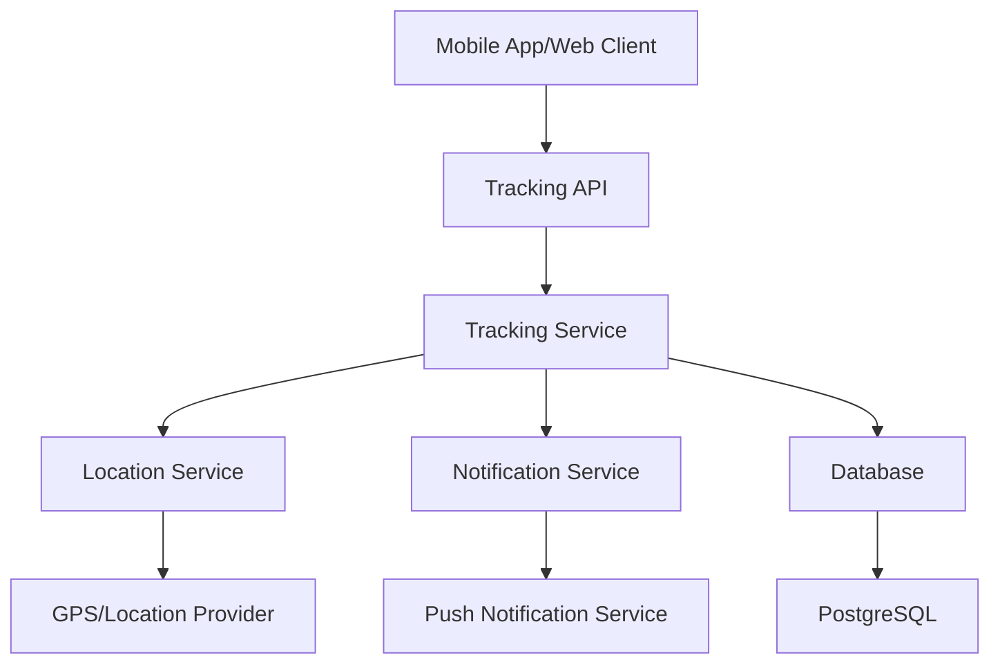

# Real-Time Tracking Design Document

## Overview

The real-time tracking system provides continuous monitoring and status updates for trips and loads throughout the transportation journey. The system integrates with the existing TripLink architecture, extending current models and handlers to support location tracking, status updates, automated notifications, and real-time data synchronization.

## Architecture

### High-Level Architecture

The tracking system follows a layered architecture pattern:

1. **Data Layer**: Extended models for tracking data storage
2. **Service Layer**: Business logic for tracking operations and calculations
3. **API Layer**: RESTful endpoints for tracking operations
4. **Notification Layer**: Real-time notifications and alerts
5. **Client Layer**: Mobile and web interfaces for tracking visualization

### System Components



## Components and Interfaces

### 1. Data Models

#### TrackingRecord Model
```go
type TrackingRecord struct {
    BaseModel
    TripID          uint      `json:"trip_id"`
    LoadID          *uint     `json:"load_id,omitempty"`
    Latitude        float64   `json:"latitude"`
    Longitude       float64   `json:"longitude"`
    Altitude        *float64  `json:"altitude,omitempty"`
    Speed           *float64  `json:"speed,omitempty"`
    Heading         *float64  `json:"heading,omitempty"`
    Accuracy        *float64  `json:"accuracy,omitempty"`
    Timestamp       time.Time `json:"timestamp"`
    Source          string    `json:"source"` // GPS, MANUAL, ESTIMATED
    Status          string    `json:"status"` // ACTIVE, INACTIVE
}
```

#### TrackingStatus Model
```go
type TrackingStatus struct {
    BaseModel
    TripID              uint       `json:"trip_id"`
    LoadID              *uint      `json:"load_id,omitempty"`
    CurrentStatus       string     `json:"current_status"`
    PreviousStatus      string     `json:"previous_status"`
    StatusChangedAt     time.Time  `json:"status_changed_at"`
    EstimatedArrival    *time.Time `json:"estimated_arrival"`
    DelayMinutes        *int       `json:"delay_minutes"`
    DelayReason         string     `json:"delay_reason"`
    NextMilestone       string     `json:"next_milestone"`
    CompletionPercent   float64    `json:"completion_percent"`
}
```

#### TrackingEvent Model
```go
type TrackingEvent struct {
    BaseModel
    TripID      uint      `json:"trip_id"`
    LoadID      *uint     `json:"load_id,omitempty"`
    EventType   string    `json:"event_type"` // DEPARTURE, ARRIVAL, DELAY, MILESTONE
    EventData   string    `json:"event_data"` // JSON data specific to event
    Location    string    `json:"location"`
    Latitude    *float64  `json:"latitude"`
    Longitude   *float64  `json:"longitude"`
    Timestamp   time.Time `json:"timestamp"`
    Description string    `json:"description"`
}
```

### 2. Service Interfaces

#### TrackingService Interface
```go
type TrackingService interface {
    UpdateLocation(tripID uint, location LocationUpdate) error
    GetCurrentLocation(tripID uint) (*TrackingRecord, error)
    GetTrackingHistory(tripID uint, filters TrackingFilters) ([]TrackingRecord, error)
    UpdateTripStatus(tripID uint, status string) error
    CalculateETA(tripID uint) (*time.Time, error)
    CheckForDelays(tripID uint) (*DelayInfo, error)
    GetTrackingEvents(tripID uint) ([]TrackingEvent, error)
}
```

#### NotificationService Interface
```go
type NotificationService interface {
    SendTrackingNotification(userID uint, notification TrackingNotification) error
    SendDelayAlert(tripID uint, delayInfo DelayInfo) error
    SendStatusUpdate(tripID uint, status string) error
    SendArrivalNotification(tripID uint) error
}
```

### 3. API Endpoints

#### Tracking Endpoints
- `POST /api/trips/{trip_id}/tracking/location` - Update trip location
- `GET /api/trips/{trip_id}/tracking/current` - Get current location
- `GET /api/trips/{trip_id}/tracking/history` - Get location history
- `PUT /api/trips/{trip_id}/tracking/status` - Update trip status
- `GET /api/trips/{trip_id}/tracking/eta` - Get estimated arrival time

#### Load Tracking Endpoints
- `GET /api/loads/{load_id}/tracking` - Get load tracking information
- `GET /api/loads/{load_id}/tracking/events` - Get tracking events
- `POST /api/loads/{load_id}/tracking/subscribe` - Subscribe to tracking updates

#### Shipper/Carrier Endpoints
- `GET /api/users/{user_id}/tracking/active` - Get active trackings
- `GET /api/users/{user_id}/tracking/notifications` - Get tracking notifications

## Data Models

### Extended Trip Model
The existing Trip model will be extended with tracking-related fields:

```go
// Additional fields for Trip model
CurrentLatitude     *float64   `json:"current_latitude"`
CurrentLongitude    *float64   `json:"current_longitude"`
LastLocationUpdate  *time.Time `json:"last_location_update"`
TrackingEnabled     bool       `gorm:"default:true" json:"tracking_enabled"`
TrackingRecords     []TrackingRecord `json:"tracking_records,omitempty" gorm:"foreignKey:TripID"`
TrackingStatus      *TrackingStatus  `json:"tracking_status,omitempty" gorm:"foreignKey:TripID"`
TrackingEvents      []TrackingEvent  `json:"tracking_events,omitempty" gorm:"foreignKey:TripID"`
```

### Extended Load Model
The existing Load model will be extended with tracking references:

```go
// Additional fields for Load model
TrackingRecords []TrackingRecord `json:"tracking_records,omitempty" gorm:"foreignKey:LoadID"`
TrackingStatus  *TrackingStatus  `json:"tracking_status,omitempty" gorm:"foreignKey:LoadID"`
TrackingEvents  []TrackingEvent  `json:"tracking_events,omitempty" gorm:"foreignKey:LoadID"`
```

### Status Definitions

#### Trip Status Values
- `PLANNED` - Trip is scheduled but not started
- `ACTIVE` - Trip is in progress
- `IN_TRANSIT` - Currently moving between locations
- `AT_PICKUP` - At pickup location
- `AT_DELIVERY` - At delivery location
- `DELAYED` - Behind schedule
- `COMPLETED` - Trip finished
- `CANCELLED` - Trip cancelled

#### Load Status Values
- `BOOKED` - Load is booked on trip
- `PICKUP_SCHEDULED` - Pickup appointment set
- `PICKED_UP` - Load collected from shipper
- `IN_TRANSIT` - Load being transported
- `OUT_FOR_DELIVERY` - Load on final delivery route
- `DELIVERED` - Load delivered to consignee
- `EXCEPTION` - Issue requiring attention

## Error Handling

### Error Types
1. **Location Errors**: GPS unavailable, invalid coordinates
2. **Network Errors**: Connection failures, timeout issues
3. **Data Validation Errors**: Invalid status transitions, missing required fields
4. **Authorization Errors**: Unauthorized tracking updates
5. **System Errors**: Database failures, service unavailability

### Error Response Format
```go
type TrackingError struct {
    Code        string    `json:"code"`
    Message     string    `json:"message"`
    Details     string    `json:"details,omitempty"`
    Timestamp   time.Time `json:"timestamp"`
    TripID      *uint     `json:"trip_id,omitempty"`
    LoadID      *uint     `json:"load_id,omitempty"`
}
```

### Retry Strategy
- **Location Updates**: Exponential backoff with max 3 retries
- **Status Updates**: Immediate retry once, then queue for later processing
- **Notifications**: Retry with increasing intervals up to 24 hours

## Testing Strategy

### Unit Testing
- **Model Tests**: Validate data model relationships and constraints
- **Service Tests**: Test business logic for tracking calculations and status transitions
- **Handler Tests**: Verify API endpoint behavior and error handling
- **Utility Tests**: Test helper functions for distance calculations and ETA estimation

### Integration Testing
- **Database Tests**: Verify tracking data persistence and retrieval
- **API Tests**: End-to-end testing of tracking endpoints
- **Notification Tests**: Verify notification delivery and formatting
- **Real-time Tests**: Test WebSocket connections and live updates

### Performance Testing
- **Load Testing**: Simulate high-frequency location updates
- **Stress Testing**: Test system behavior under extreme load
- **Latency Testing**: Measure response times for tracking queries
- **Battery Impact Testing**: Assess mobile app battery consumption

### Test Data Management
- **Mock GPS Data**: Simulated location sequences for testing
- **Test Trips**: Predefined trip scenarios with known outcomes
- **Notification Mocks**: Test notification delivery without external services
- **Time Simulation**: Fast-forward time for testing time-dependent features

### Monitoring and Alerting
- **System Health**: Monitor API response times and error rates
- **Data Quality**: Track GPS accuracy and update frequency
- **User Experience**: Monitor notification delivery success rates
- **Performance Metrics**: Track database query performance and resource usage