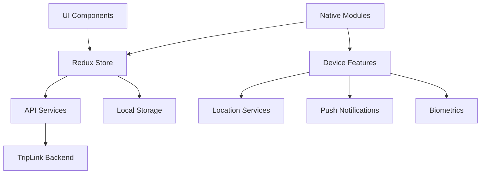
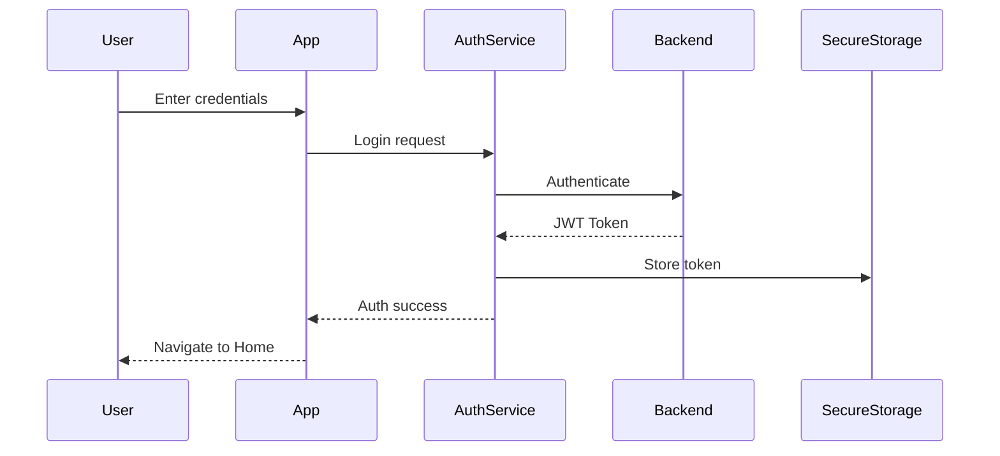
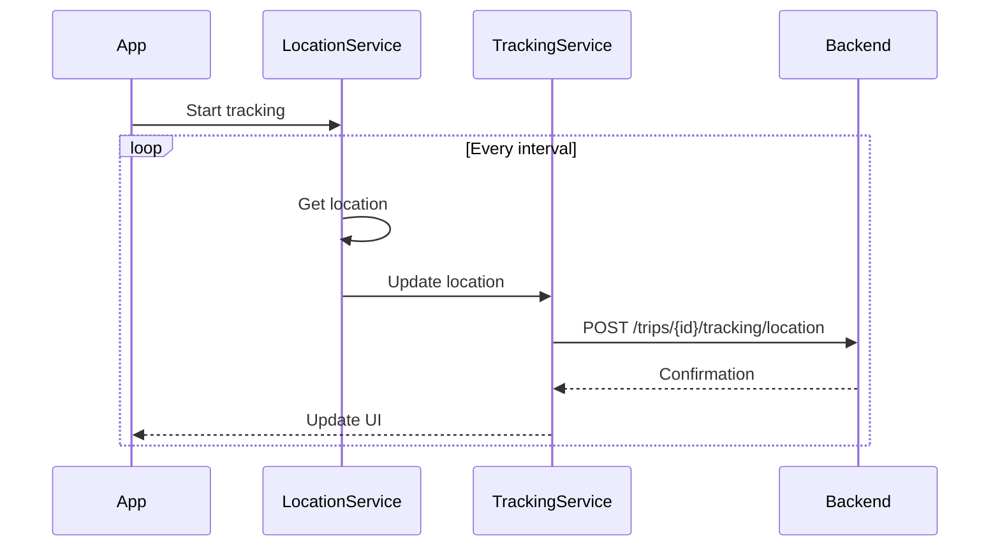
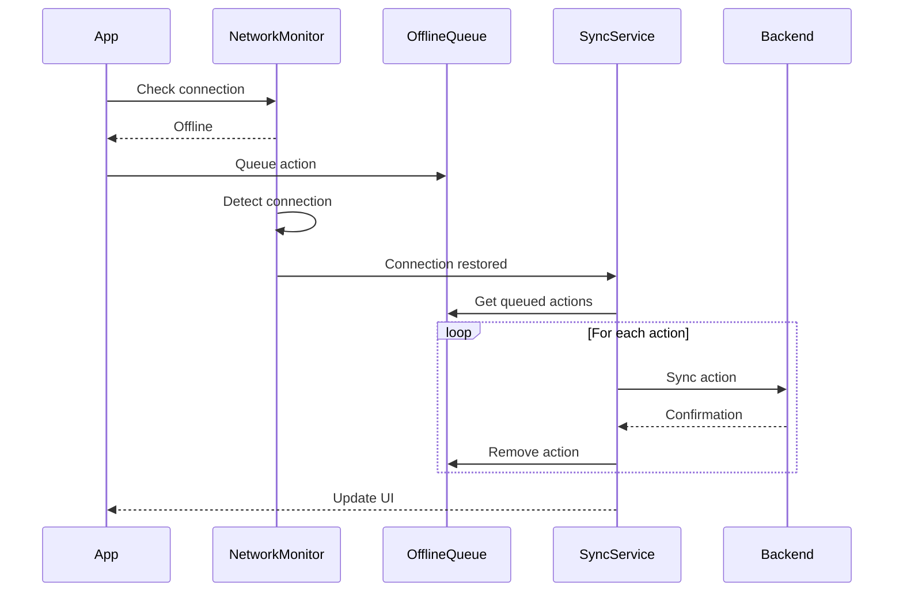
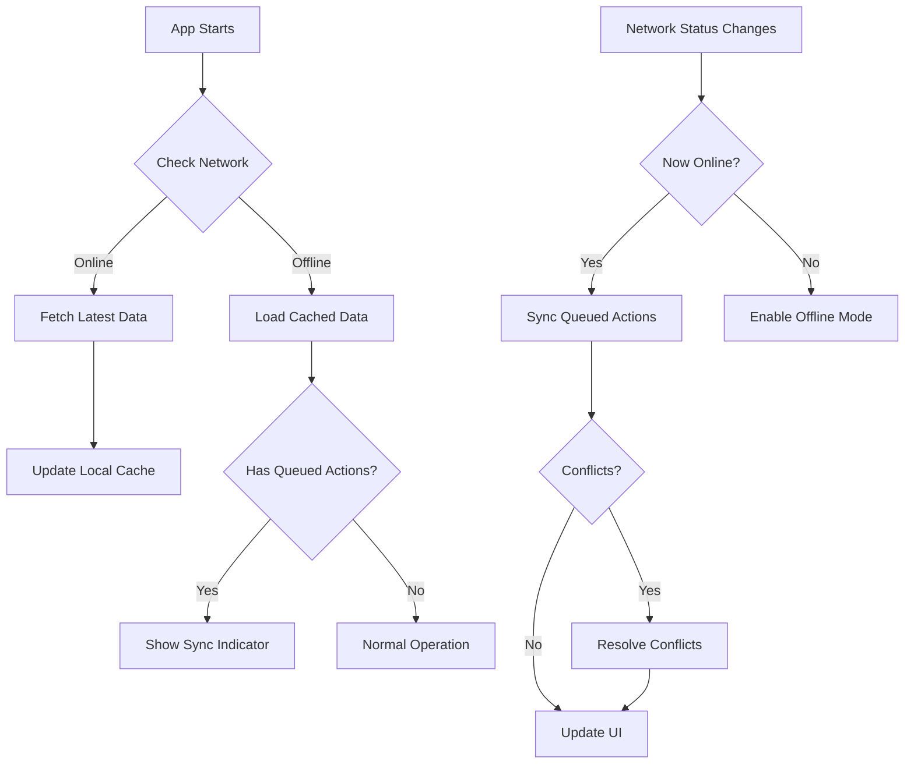
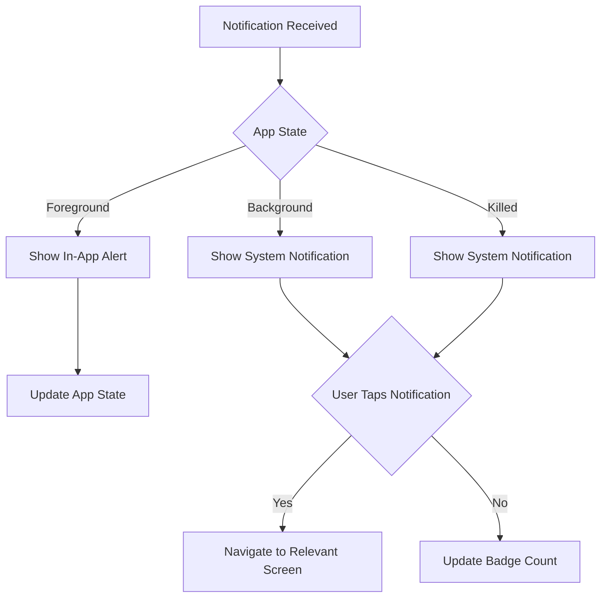

# TripLink Mobile App Design Document

## Overview

The TripLink Mobile App is a cross-platform mobile application built with Expo/React Native that provides carriers and shippers with real-time tracking, shipment management, and communication capabilities on the go. The app integrates with the existing TripLink backend to provide a seamless mobile experience for logistics management, with a focus on real-time tracking, notifications, and offline capabilities.

## Architecture

### High-Level Architecture

The TripLink Mobile App follows a layered architecture pattern:

1. **UI Layer**: React Native components and screens using react-native-paper
2. **State Management Layer**: Redux store with slices for different domains
3. **API Layer**: Services for communicating with the TripLink backend
4. **Persistence Layer**: Local storage for offline functionality
5. **Device Integration Layer**: Native device features (location, notifications, etc.)

### System Components



## Components and Interfaces

### 1. Authentication Module

The Authentication Module handles user login, token management, and secure storage of credentials.

#### Key Components:
- **LoginScreen**: UI for user authentication
- **AuthService**: API service for authentication operations
- **AuthSlice**: Redux slice for auth state management
- **SecureStorage**: Secure storage for tokens and credentials
- **BiometricAuth**: Integration with device biometric capabilities

#### Authentication Flow:



### 2. Trip Management Module

The Trip Management Module allows carriers to view and manage their trips.

#### Key Components:
- **TripListScreen**: Displays active and upcoming trips
- **TripDetailScreen**: Shows detailed trip information
- **TripService**: API service for trip operations
- **TripSlice**: Redux slice for trip state management
- **TripMap**: Interactive map component for trip visualization

#### Data Models:

```typescript
interface Trip {
  id: number;
  status: string;
  originCity: string;
  originState: string;
  destinationCity: string;
  destinationState: string;
  departureDate: string;
  estimatedArrival: string;
  currentLatitude?: number;
  currentLongitude?: number;
  lastLocationUpdate?: string;
  trackingEnabled: boolean;
  loads: Load[];
}

interface Load {
  id: number;
  bookingReference: string;
  status: string;
  shipperId: number;
  pickupAddress: string;
  deliveryAddress: string;
  description: string;
}
```

### 3. Tracking Module

The Tracking Module provides real-time location tracking and status updates.

#### Key Components:
- **TrackingScreen**: Displays real-time tracking information
- **LocationService**: Manages device location updates
- **TrackingService**: API service for tracking operations
- **TrackingSlice**: Redux slice for tracking state management
- **BackgroundTracking**: Service for background location updates

#### Location Update Flow:



### 4. Notification Module

The Notification Module handles push notifications and in-app alerts.

#### Key Components:
- **NotificationService**: Manages push notification registration and handling
- **NotificationCenter**: UI component for displaying notifications
- **NotificationSlice**: Redux slice for notification state management
- **NotificationPreferences**: Settings for notification configuration

#### Notification Data Model:

```typescript
interface Notification {
  id: number;
  userId: number;
  title: string;
  message: string;
  type: string;
  relatedId?: number;
  isRead: boolean;
  createdAt: string;
}
```

### 5. Offline Support Module

The Offline Support Module enables app functionality without internet connectivity.

#### Key Components:
- **SyncService**: Manages data synchronization
- **OfflineQueue**: Stores actions for later synchronization
- **NetworkMonitor**: Detects network status changes
- **CacheManager**: Manages local data caching

#### Offline Sync Flow:



### 6. Messaging Module

The Messaging Module enables communication between users.

#### Key Components:
- **ConversationListScreen**: Displays all conversations
- **ConversationScreen**: Shows message thread
- **MessageService**: API service for messaging operations
- **MessageSlice**: Redux slice for message state management

#### Message Data Model:

```typescript
interface Message {
  id: number;
  conversationId: number;
  senderId: number;
  receiverId: number;
  content: string;
  timestamp: string;
  isRead: boolean;
  relatedEntityType?: string;
  relatedEntityId?: number;
}

interface Conversation {
  id: number;
  participants: User[];
  lastMessage: Message;
  unreadCount: number;
}
```

## UI Design

### Navigation Structure

The app will use a tab-based navigation structure with the following main tabs:

1. **Dashboard**: Home screen with summary information
2. **Trips/Loads**: List of trips (for carriers) or loads (for shippers)
3. **Tracking**: Real-time tracking information
4. **Messages**: Conversations with other users
5. **Profile**: User settings and preferences

Each tab will have its own navigation stack for drilling down into details.

### Key Screens

1. **Login Screen**: Authentication UI with email/password and biometric options
2. **Dashboard Screen**: Summary of active trips/loads and important notifications
3. **Trip List Screen**: List of trips with status indicators and search/filter options
4. **Trip Detail Screen**: Detailed trip information with map, loads, and actions
5. **Load Detail Screen**: Detailed load information with tracking and communication options
6. **Tracking Screen**: Real-time map with location, status, and ETA information
7. **Messaging Screen**: Conversation interface with message history and input
8. **Profile Screen**: User information and app settings

### Design System

The app will use a consistent design system with the following components:

- **Typography**: Hierarchical text styles for headings, body text, and captions
- **Colors**: Primary, secondary, and accent colors with light/dark mode support
- **Components**: Reusable UI components like buttons, cards, and list items
- **Icons**: Consistent icon set for navigation and actions
- **Spacing**: Standardized spacing system for layout consistency

## Data Models

### Extended Models for Mobile App

#### User Model
```typescript
interface User {
  id: number;
  email: string;
  firstName: string;
  lastName: string;
  role: 'CARRIER' | 'SHIPPER' | 'ADMIN';
  company: string;
  phoneNumber: string;
  profileImage?: string;
  notificationPreferences: NotificationPreferences;
}

interface NotificationPreferences {
  tripDeparture: boolean;
  tripArrival: boolean;
  delays: boolean;
  etaUpdates: boolean;
  loadStatus: boolean;
  locationUpdates: boolean;
  emailEnabled: boolean;
  pushEnabled: boolean;
}
```

#### TrackingUpdate Model
```typescript
interface TrackingUpdate {
  tripId: number;
  latitude: number;
  longitude: number;
  altitude?: number;
  speed?: number;
  heading?: number;
  accuracy?: number;
  timestamp: string;
  source: 'GPS' | 'NETWORK' | 'MANUAL' | 'ESTIMATED';
  batteryLevel?: number;
  isOffline: boolean;
}
```

#### AppSettings Model
```typescript
interface AppSettings {
  trackingEnabled: boolean;
  trackingFrequency: number; // seconds
  backgroundTrackingEnabled: boolean;
  dataSavingMode: boolean;
  offlineMode: boolean;
  biometricAuthEnabled: boolean;
  darkMode: boolean | 'system';
  language: string;
}
```

## API Integration

### API Endpoints

The mobile app will integrate with the following TripLink backend API endpoints:

#### Authentication Endpoints
- `POST /api/auth/login` - User login
- `POST /api/auth/refresh` - Refresh authentication token

#### Trip Endpoints
- `GET /api/users/{user_id}/trips` - Get user trips
- `GET /api/trips/{trip_id}` - Get trip details
- `PUT /api/trips/{trip_id}/status` - Update trip status

#### Load Endpoints
- `GET /api/users/{user_id}/loads` - Get user loads
- `GET /api/loads/{load_id}` - Get load details
- `PUT /api/loads/{load_id}/status` - Update load status

#### Tracking Endpoints
- `POST /api/trips/{trip_id}/tracking/location` - Update trip location
- `GET /api/trips/{trip_id}/tracking/current` - Get current location
- `GET /api/trips/{trip_id}/tracking/history` - Get location history
- `GET /api/trips/{trip_id}/tracking/eta` - Get estimated arrival time
- `GET /mobile/trips/{trip_id}/tracking` - Get lightweight tracking data

#### Notification Endpoints
- `GET /api/users/{user_id}/notifications` - Get user notifications
- `PUT /api/notifications/{id}/read` - Mark notification as read
- `PUT /api/users/{user_id}/notifications/read-all` - Mark all notifications as read

#### Messaging Endpoints
- `GET /api/users/{user_id}/conversations` - Get user conversations
- `GET /api/conversations/{conversation_id}/messages` - Get conversation messages
- `POST /api/conversations/{conversation_id}/messages` - Send a message

### API Service Implementation

The app will use a service-based approach for API integration:

```typescript
// Base API service with authentication and error handling
class ApiService {
  async request(endpoint, method, data) {
    // Handle authentication, errors, offline mode, etc.
  }
}

// Specific domain services
class AuthService extends ApiService {
  async login(email, password) { /* ... */ }
  async refreshToken() { /* ... */ }
  async logout() { /* ... */ }
}

class TripService extends ApiService {
  async getTrips(userId) { /* ... */ }
  async getTripDetails(tripId) { /* ... */ }
  async updateTripStatus(tripId, status) { /* ... */ }
}

class TrackingService extends ApiService {
  async updateLocation(tripId, location) { /* ... */ }
  async getCurrentLocation(tripId) { /* ... */ }
  async getTrackingHistory(tripId, filters) { /* ... */ }
}
```

## Offline Support

### Offline Strategy

The app will implement a comprehensive offline strategy:

1. **Data Caching**: Store essential data locally for offline access
2. **Action Queueing**: Queue user actions for synchronization when online
3. **Conflict Resolution**: Handle conflicts when synchronizing offline changes
4. **UI Indicators**: Clearly indicate offline status and queued actions
5. **Prioritization**: Ensure critical features work offline

### Offline Data Storage

The app will use a combination of storage mechanisms:

- **Redux Persist**: Persist Redux store to AsyncStorage
- **SQLite**: Store larger datasets and historical data
- **Secure Storage**: Store sensitive information like authentication tokens

### Sync Strategy



## Location Tracking

### Location Tracking Strategy

The app will implement an efficient location tracking strategy:

1. **Adaptive Frequency**: Adjust tracking frequency based on trip duration and battery level
2. **Geofencing**: Use geofences for key locations to trigger status updates
3. **Activity Recognition**: Detect when the vehicle is moving to optimize tracking
4. **Batched Updates**: Group location updates to reduce network requests
5. **Compression**: Compress location data to minimize bandwidth usage

### Battery Optimization

The app will implement battery optimization techniques:

- **Reduced Frequency**: Lower update frequency when battery is low
- **Significant Changes**: Use significant-change location updates when appropriate
- **Stop Detection**: Pause frequent updates when vehicle is stopped
- **Optimized Accuracy**: Adjust location accuracy based on context

## Push Notifications

### Notification Types

The app will support the following notification types:

1. **Status Updates**: Trip and load status changes
2. **ETA Updates**: Changes to estimated arrival times
3. **Delay Alerts**: Notifications about delays
4. **Messages**: New messages from other users
5. **System Notifications**: App updates and maintenance alerts

### Notification Handling



## Error Handling

### Error Types

1. **Network Errors**: Connection failures, timeout issues
2. **Authentication Errors**: Invalid credentials, expired tokens
3. **Data Validation Errors**: Invalid input, server-side validation failures
4. **Permission Errors**: Missing device permissions
5. **System Errors**: App crashes, unexpected behavior

### Error Handling Strategy

The app will implement a comprehensive error handling strategy:

1. **Global Error Boundary**: Catch and log unhandled exceptions
2. **Retry Logic**: Automatically retry failed network requests
3. **Fallback UI**: Show appropriate UI when data cannot be loaded
4. **Error Logging**: Log errors for debugging and analytics
5. **User Feedback**: Provide clear error messages to users

### Error Response Format

```typescript
interface ErrorResponse {
  code: string;
  message: string;
  details?: string;
  timestamp: string;
}
```

## Testing Strategy

### Unit Testing

- **Component Tests**: Test individual React components
- **Service Tests**: Test API services and business logic
- **Redux Tests**: Test reducers, actions, and selectors
- **Utility Tests**: Test helper functions and utilities

### Integration Testing

- **Screen Tests**: Test complete screens and navigation
- **API Integration Tests**: Test integration with backend APIs
- **Offline Tests**: Test offline functionality and synchronization
- **Device Feature Tests**: Test integration with device features

### End-to-End Testing

- **User Flow Tests**: Test complete user journeys
- **Authentication Tests**: Test login, logout, and token refresh
- **Tracking Tests**: Test location tracking and updates
- **Notification Tests**: Test push notification handling

### Performance Testing

- **Load Time Tests**: Measure app startup and screen load times
- **Memory Usage Tests**: Monitor memory usage during extended use
- **Battery Impact Tests**: Measure battery consumption during tracking
- **Network Usage Tests**: Monitor data usage for different operations

## Security Considerations

### Authentication Security

- **Secure Token Storage**: Store authentication tokens in secure storage
- **Token Refresh**: Implement automatic token refresh
- **Biometric Authentication**: Support for fingerprint and face recognition
- **Session Management**: Handle multiple devices and session expiration

### Data Security

- **Data Encryption**: Encrypt sensitive data at rest
- **Secure Communication**: Use HTTPS for all API requests
- **Certificate Pinning**: Implement certificate pinning for API requests
- **Data Minimization**: Only store necessary data locally

### Privacy Considerations

- **Location Privacy**: Clear user consent for location tracking
- **Data Collection**: Transparent data collection policies
- **User Control**: Allow users to delete their data and opt out of tracking
- **Background Location**: Clear indicators when tracking in background

## Deployment Strategy

### App Store Deployment

- **App Store Optimization**: Optimize listings for discoverability
- **Screenshots and Previews**: Create compelling visual assets
- **Release Notes**: Clear documentation of features and changes
- **Phased Rollout**: Gradual rollout to detect issues early

### Update Strategy

- **In-App Updates**: Notify users of available updates
- **Forced Updates**: Require updates for critical changes
- **Feature Flags**: Control feature availability remotely
- **A/B Testing**: Test new features with subset of users

### Analytics and Monitoring

- **Usage Analytics**: Track feature usage and user engagement
- **Crash Reporting**: Automatic crash reporting and analysis
- **Performance Monitoring**: Monitor app performance metrics
- **User Feedback**: In-app feedback mechanism

## Accessibility

The app will implement comprehensive accessibility features:

- **Screen Reader Support**: Full compatibility with VoiceOver and TalkBack
- **Dynamic Text Sizes**: Support for system text size settings
- **Color Contrast**: Ensure sufficient contrast for all UI elements
- **Keyboard Navigation**: Support for external keyboards
- **Reduced Motion**: Option to reduce animations for users with motion sensitivity